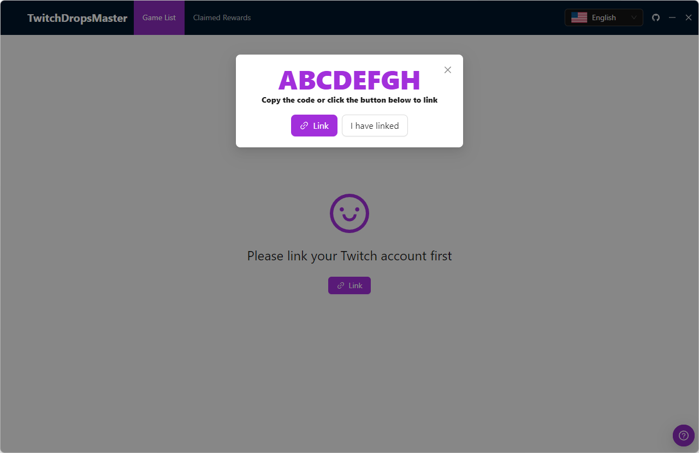
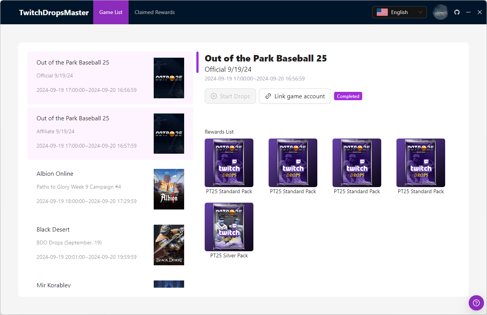
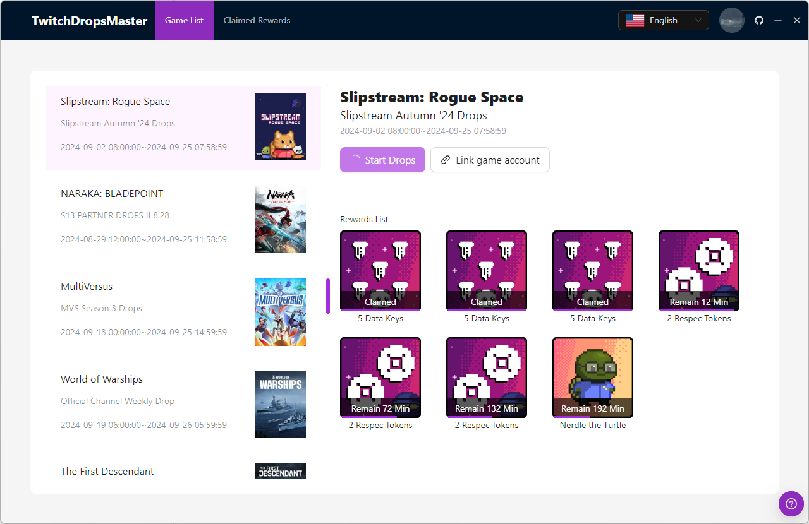
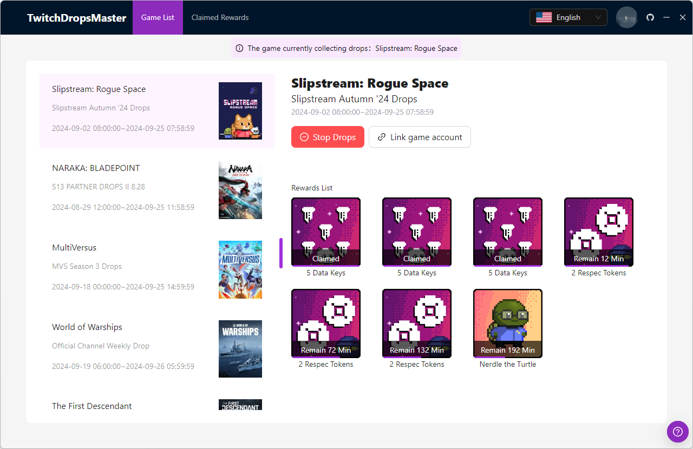
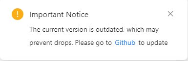

# TwitchDropsMaster

A Windows application that automatically watches Twitch streams and claims drop rewards for you. No additional steps needed—just download and start using.

## Usage

```sh
git clone https://github.com/phaoer/TwitchDropsMaster.git
```

- Run exe
- Link your twitch account
- Enjoy

**The application does not include network acceleration features. Please ensure you can access [Twitch](https://www.twitch.tv/) before using it.**

## Features

- Fully automated: Automatically watches live streams and claims rewards.
- Waiting mechanism: If no streamers are live for a game you like, TwitchDropsMaster will keep searching until a streamer goes live or you switch to a different game with active drops.

## Future

- Queue mechanism: You can add multiple games to the queue at once, and TwitchDropsMaster will complete drop claiming one by one, unless the drop event for a game ends.

## Preview 





## Warning

Automation tools come with some uncertainties, so please consider carefully before using.

When the following prompt appears, please update in time.



You only need to re-run：
```sh
git pull 
```

## License
[MIT](https://github.com/phaoer/TwitchDropsMaster/blob/master/LICENSE)