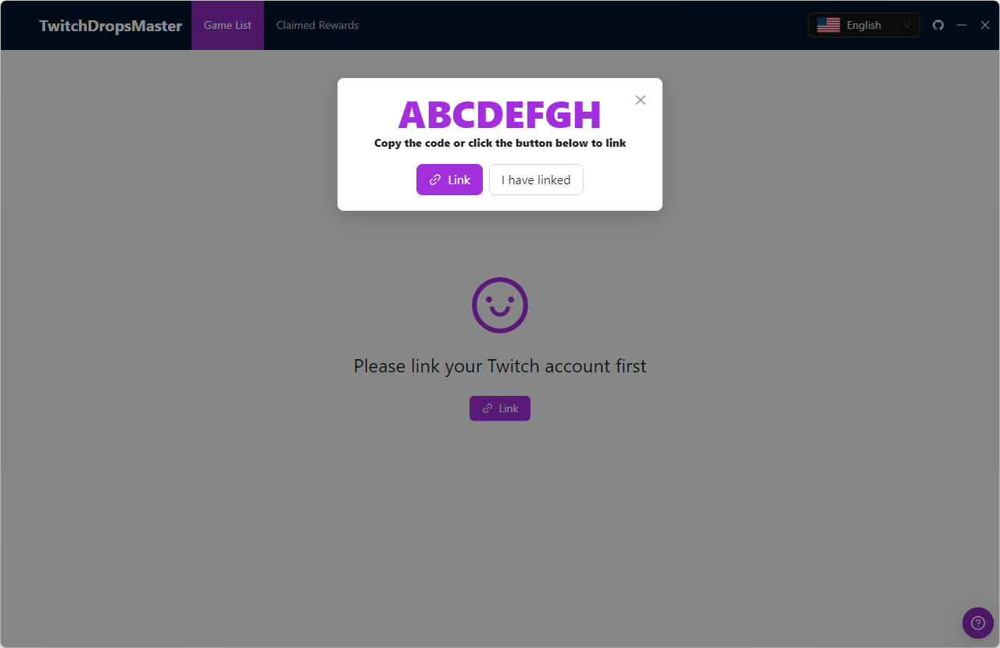
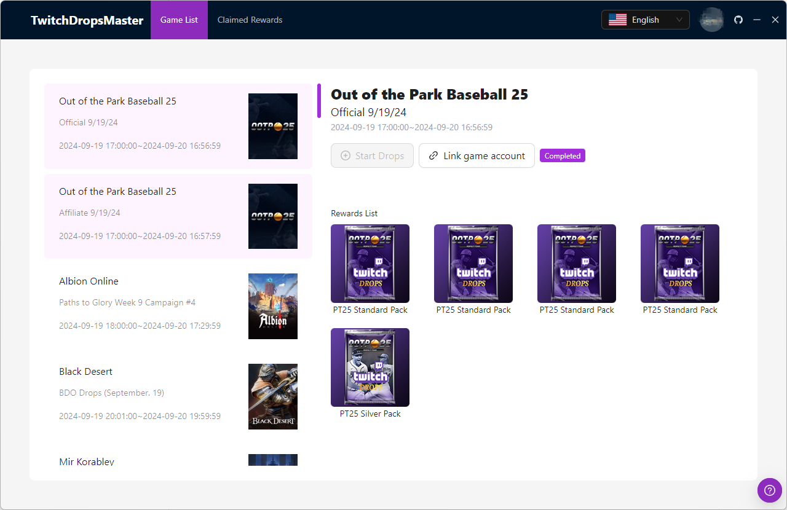
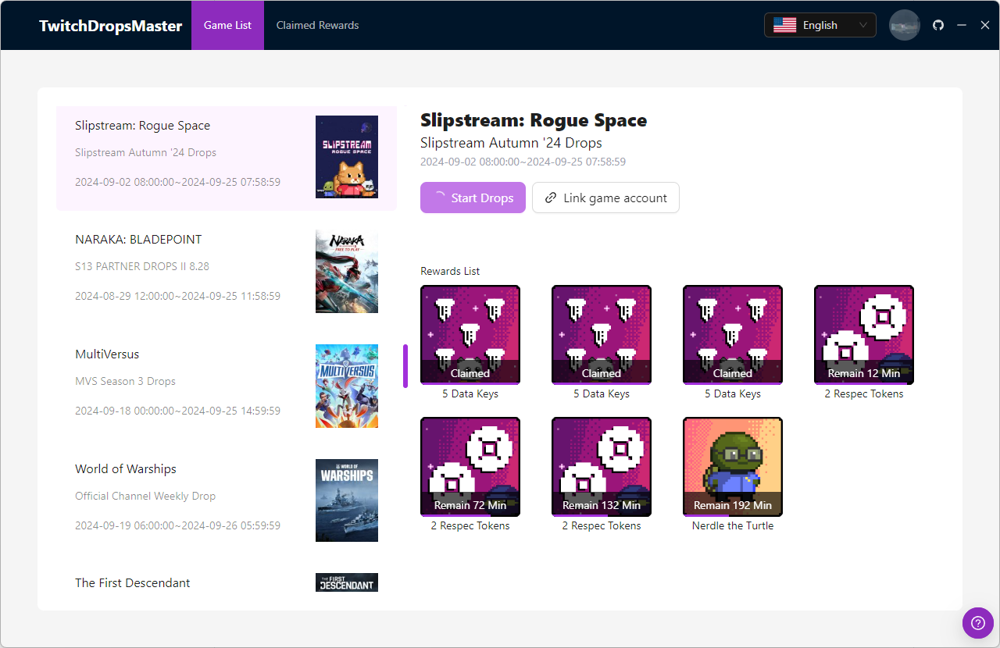
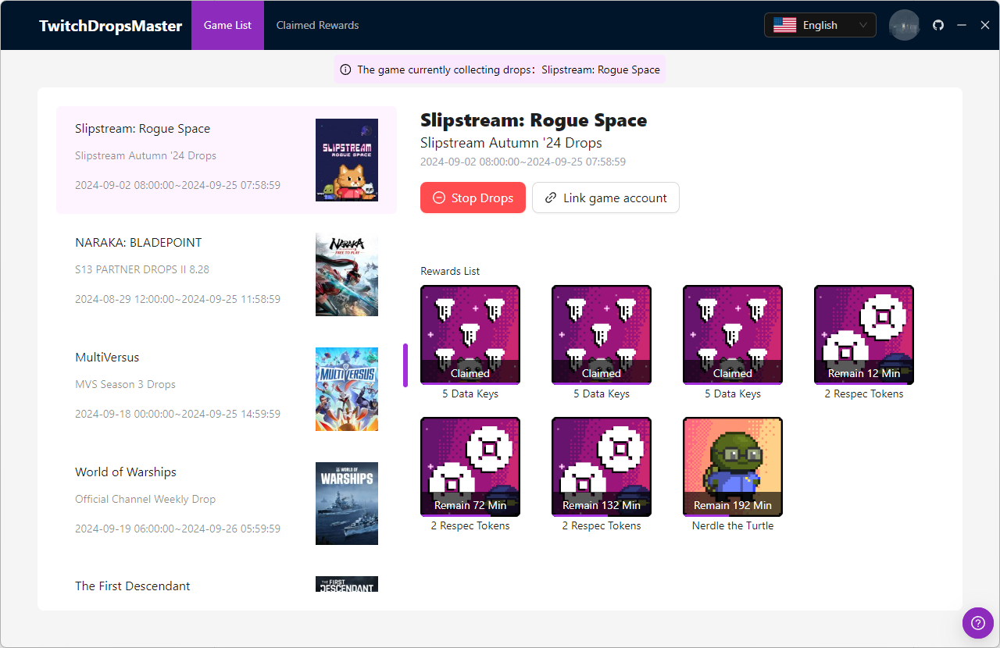
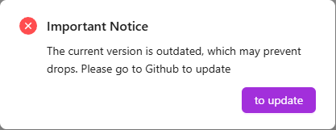

# TwitchDropsMaster

一款适用于 Windows 的应用程序，可自动观看 Twitch 直播并为你领取掉宝奖励。无需额外操作——下载即可使用。

## 🌐 切换语言

- [English](./README.md)
- [中文](./README.zh-CN.md)

## 🔨 使用方法

```sh
git clone https://github.com/phaoer/TwitchDropsMaster.git
```

- 运行 exe 程序
- 绑定你的 Twitch 账号
- 开始享受自动掉宝体验

**本程序不包含网络加速功能，请确保你可以正常访问 [Twitch](https://www.twitch.tv/) 后再使用。**

## ⚙️ SOCKS5 代理使用提示

### 全局设置

在 Windows 中通过系统环境变量配置：

**环境变量 → 用户变量 / 系统变量 → 添加 `HTTP_PROXY` 和 `HTTPS_PROXY`**

### PowerShell 临时设置

仅在当前会话生效：

```powershell
$env:HTTPS_PROXY="http://127.0.0.1:1080"
$env:HTTP_PROXY="http://127.0.0.1:1080"
./TwitchDropsMaster.exe
```

## ⚡ 功能特色

- 全自动：自动观看直播并领取掉宝奖励
- 等待机制：当你喜欢的游戏暂时没有主播开播时，TwitchDropsMaster 会持续搜索，直到有主播上线或你切换到另一个有掉宝活动的游戏

## 🚀 未来计划

- 队列机制：你可以一次性添加多个游戏到队列中，TwitchDropsMaster 将依次完成每个游戏的掉宝领取（前提是该游戏的掉宝活动尚未结束）

## 🔍 预览图

  
  
  


## ⚠️ 警告

自动化工具存在一定的不确定性，请谨慎使用。

当出现以下提示时，请及时更新版本：



## 📜 许可证

[MIT](https://github.com/phaoer/TwitchDropsMaster/blob/master/LICENSE)
